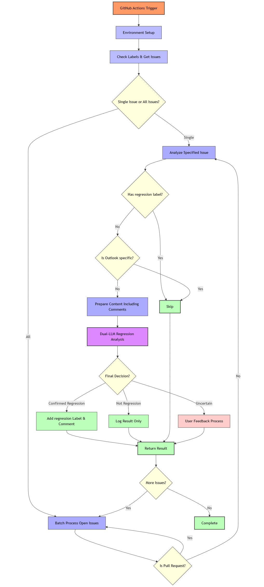
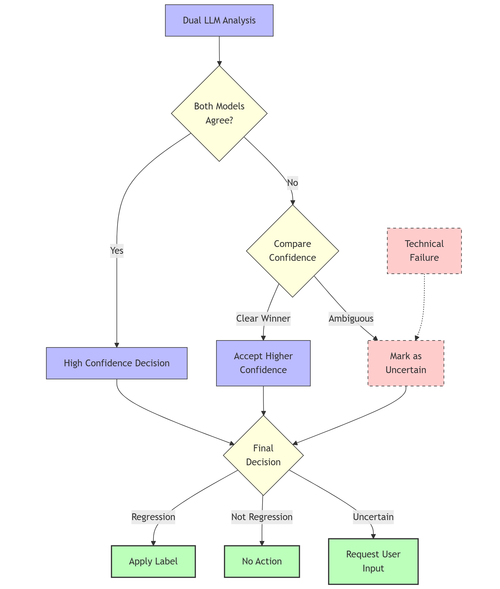
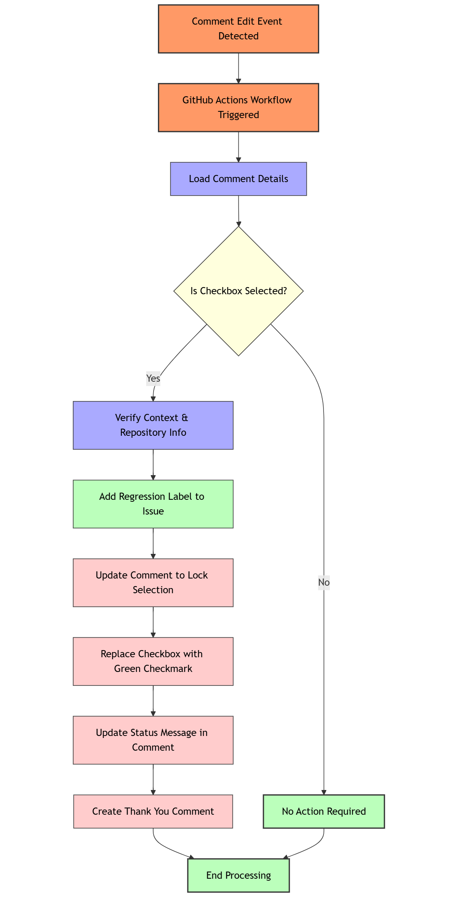

# GitHub Issue Regression Analyzer: Dev Spec

## 1. Executive Summary

The GitHub Issue Regression Analyzer is an automated system that leverages Large Language Models (LLMs) to analyze GitHub issues and identify potential regression bugs. The system employs a multi-stage analysis approach, including dual-LLM verification and optional user confirmation, to ensure high-quality categorization. When a regression is detected with high confidence, the system automatically applies a "regression" label and adds an explanatory comment. For uncertain cases, the system requests confirmation from users through an interactive comment.

This specification outlines the architecture, workflows, and implementation details of the system.

## 2. System Architecture

### 2.1 Core Components

1. **Issue Analyzer Module**
   - Performs initial analysis of GitHub issues
   - Includes specialized detection for Outlook-exclusive issues
   - Implements dual-LLM verification mechanism

2. **User Feedback Module**
   - Manages interactive user confirmation when regression status is uncertain
   - Processes user selections via comment edits
   - Automatically applies labels based on user feedback

3. **GitHub Integration Layer**
   - Handles API interactions with GitHub (issues, comments, labels)
   - Manages webhook event processing
   - Controls workflow triggers

### 2.2 Technical Stack

- **Language & Runtime**: Python 3.11
- **GitHub Integration**: GitHub Actions, GitHub API
- **AI Services**: Azure OpenAI (GPT-4o model)
- **Authentication**: Azure AD token-based authentication
- **API Interfaces**: Azure Identity, LangChain, Requests

### 2.3 System Flow Diagram



## 3. Core Functionality

### 3.1 Issue Analysis Process

The system employs a three-layer detection approach:

#### 3.1.1 Filter Layer: Outlook-Exclusive Detection

```python
def is_outlook_exclusive_issue(issue_title, issue_body, chat_model):
    # Analyzes if an issue is exclusively related to Microsoft Outlook
    # Returns True for Outlook-specific issues (to be skipped)
    # Returns False for issues that should be analyzed
```

- Uses a specialized LLM prompt to determine if an issue is Outlook-specific
- Returns True if the model identifies the issue as Outlook-exclusive with >0.7 confidence
- Skips further analysis for Outlook-exclusive issues to reduce false positives

#### 3.1.2 Analysis Layer: Dual-LLM Verification

```python
def analyze_issue_for_regression(issue_content, issue_number, chat_model):
    # Performs dual independent analyses:
    # 1. Initial analysis to determine if the issue is a regression
    # 2. Verification analysis to confirm or challenge the initial result
```

**Key Features:**
- Two independent LLM analyses for higher accuracy
- Confidence score calculation for each analysis
- Decision fusion logic:
  - Both agree → High confidence decision
  - Disagreement → Decision based on confidence levels or "uncertain"
  - Technical failure → Default to "uncertain"

#### 3.1.3 Decision Logic Diagram



### 3.2 User Feedback Mechanism

For cases where the LLM analysis is uncertain, the system requests user input:

```python
comment_body = f"""## Regression Analysis Needs Your Input

Our automated system analyzed this issue but couldn't determine with confidence if this is a regression bug.

A regression bug is when **functionality that previously worked properly no longer works** after a recent change.

**If you believe this is a regression issue, please confirm below:**

- [ ] Yes, confirm this is a regression issue

<!-- comment_id:{issue_number}:{repo_owner}:{repo_name} -->
```

#### 3.2.1 User Feedback Processing

When a user selects the option:
1. A GitHub Actions workflow is triggered by the comment edit event
2. The workflow verifies if the checkbox was selected
3. If selected, it adds the "regression" label to the issue
4. The checkbox is replaced with a green checkmark (✅) to lock the selection
5. A confirmation comment is added to notify the user




## 4. Implementation Details

### 4.1 GitHub Actions Workflows

#### 4.1.1 Main Issue Analysis Workflow

```yaml
name: LLM Issue Analyzer

on:
  issues:
    types: [opened]
  workflow_dispatch:

jobs:
  analyze_issues:
    runs-on: ubuntu-latest
    # Steps include:
    # 1. Repository checkout
    # 2. Python setup
    # 3. Azure authentication
    # 4. Dependencies installation
    # 5. Issue analysis execution
```

#### 4.1.2 User Feedback Processing Workflow

```yaml
name: Process Regression Feedback

on:
  issue_comment:
    types: [edited]

jobs:
  process_feedback:
    if: contains(github.event.comment.body, '## Regression Analysis Needs Your Input')
    # Steps include:
    # 1. Repository checkout
    # 2. Python setup
    # 3. Simple dependencies installation
    # 4. Feedback processing script execution
```

### 4.2 Key Functions and APIs

#### 4.2.1 Azure OpenAI Integration

```python
def get_azure_chat_model(model_id="gpt-4o"):
    """Get a configured Azure OpenAI chat model through LangChain."""
    chat_model = AzureChatOpenAI(
        deployment_name=model_id,
        api_version="2025-01-01-preview",
        azure_endpoint="https://xxx.openai.azure.com/",
        azure_ad_token_provider=get_azure_ad_token(),
        temperature=0,
        model_kwargs={"response_format": {"type": "json_object"}}
    )
    return chat_model
```

#### 4.2.2 GitHub Label Management

```python
def ensure_label_exists(repo_owner, repo_name, github_token, label_name, color, description=None):
    """
    Ensure a label exists with the specified color and description.
    If the label doesn't exist, create it. If it exists but with different settings, update it.
    """
```

#### 4.2.3 User Selection Processing

```python
def process_regression_feedback():
    """Process user feedback on regression analysis."""
    # Checks if the checkbox is selected
    is_confirmed = "- [x] Yes, confirm this is a regression issue" in comment_body
    
    # If selected, add the regression label and update the comment
    if is_confirmed:
        # Add label
        # Replace checkbox with green checkmark
        # Add thank you comment
```

## 5. User Experience

### 5.1 Automated Regression Detection

When the system identifies an issue as a regression with high confidence:

1. The "regression" label is automatically applied
2. An explanatory comment is added:
   ```
   This issue was automatically labeled as a regression based on dual-LLM analysis of the issue content.

   Reason: [Detailed explanation from the analysis]
   ```

### 5.2 User Confirmation Flow

For uncertain cases, the system:

1. Posts a comment with a confirmation checkbox
2. User selects the checkbox if they believe it's a regression
3. System automatically detects the edit event
4. System applies the "regression" label and locks the selection
5. System provides confirmation feedback:
   ```
   Thank you for confirming this is a regression issue. The issue has been labeled accordingly.
   ```

## 6. Error Handling and Robustness

### 6.1 Failure Modes and Handling

- **Service Unavailability**: Fails gracefully if Azure OpenAI service is unavailable
- **Invalid User Input**: Properly validates user selections before processing
- **Partial Processing**: Continues with remaining issues even if one fails

### 6.2 Security Considerations

- Uses Azure AD token-based authentication for secure AI service access
- Employs GitHub token with minimal required permissions
- Hides sensitive tokens in GitHub Secrets

## 7. Future Enhancements

- **Enhanced LLM Analysis**: Add more specialized prompts for different issue types
- **Statistical Tracking**: Implement metrics collection for system accuracy
- **User Interface**: Improve visual feedback for user confirmation
- **RAG enhanced search**: Attach RAG based on historical issues
- **Multiple Label Support**: Extend to detect other issue types beyond regressions

## 8. Conclusion

The GitHub Issue Regression Analyzer provides an automated, AI-powered solution for identifying regression issues in software development. By combining sophisticated LLM analysis with user feedback mechanisms, the system delivers high-quality issue categorization that helps development teams prioritize and address regression bugs more efficiently.