# Issue Agent System - Layered Architecture Flow Diagram

Based on the actual implementation analysis, this diagram represents the complete flow from GitHub event trigger to final results generation in the Issue Agent system.

```mermaid
flowchart TD
    %% GitHub Event Layer
    subgraph "GitHub Event Layer"
        GH_EVENT[GitHub Event Trigger]
        ISSUE_OPEN[Issue Opened]
        COMMENT_CREATE[Comment Created]
        WORKFLOW_DISPATCH[Manual Trigger]
        
        GH_EVENT --> ISSUE_OPEN
        GH_EVENT --> COMMENT_CREATE
        GH_EVENT --> WORKFLOW_DISPATCH
    end

    %% Entry Point Layer
    subgraph "Entry Point Layer"
        MAIN_SCRIPT[intelligent_dispatch_action.py]
        CONFIG_LOAD[Load Configuration]
        ENV_VALIDATE[Validate Environment]
        
        ISSUE_OPEN --> MAIN_SCRIPT
        COMMENT_CREATE --> MAIN_SCRIPT
        WORKFLOW_DISPATCH --> MAIN_SCRIPT
        
        MAIN_SCRIPT --> CONFIG_LOAD
        CONFIG_LOAD --> ENV_VALIDATE
    end

    %% Data Fetching Layer
    subgraph "Data Fetching Layer"
        FETCH_ISSUE[fetch_issue_data]
        FETCH_COMMENT[fetch_comment_data]
        GITHUB_API[GitHub API Calls]
        
        ENV_VALIDATE --> FETCH_ISSUE
        ENV_VALIDATE --> FETCH_COMMENT
        FETCH_ISSUE --> GITHUB_API
        FETCH_COMMENT --> GITHUB_API
    end

    %% Core Orchestration Layer
    subgraph "Core Orchestration Layer"
        INTELLIGENT_DISPATCHER[IntelligentDispatcher]
        ANALYSIS_CONTEXT[AnalysisContext Storage]
        
        GITHUB_API --> INTELLIGENT_DISPATCHER
        INTELLIGENT_DISPATCHER --> ANALYSIS_CONTEXT
    end

    %% Trigger Logic Layer
    subgraph "Trigger Logic Layer"
        TRIGGER_LOGIC[TriggerLogic]
        BOT_LOOP_CHECK[Bot Loop Prevention]
        TRIGGER_DECISION[TriggerDecision]
        
        INTELLIGENT_DISPATCHER --> TRIGGER_LOGIC
        TRIGGER_LOGIC --> BOT_LOOP_CHECK
        BOT_LOOP_CHECK --> TRIGGER_DECISION
    end

    %% Strategy Selection Layer
    subgraph "Strategy Selection Layer"
        STRATEGY_ENGINE[StrategyEngine]
        ISSUE_CREATED_STRATEGY[IssueCreatedStrategy]
        COMMENT_RESPONSE_STRATEGY[CommentResponseStrategy]
        
        TRIGGER_DECISION --> STRATEGY_ENGINE
        STRATEGY_ENGINE --> ISSUE_CREATED_STRATEGY
        STRATEGY_ENGINE --> COMMENT_RESPONSE_STRATEGY
    end

    %% Strategy Analysis Layer
    subgraph "Strategy Analysis Layer"
        CONTEXT_ANALYSIS[LLM Context Analysis]
        TOOL_SELECTION[LLM Tool Selection]
        PROMPT_CUSTOMIZATION[Prompt Customization]
        
        ISSUE_CREATED_STRATEGY --> CONTEXT_ANALYSIS
        COMMENT_RESPONSE_STRATEGY --> CONTEXT_ANALYSIS
        CONTEXT_ANALYSIS --> TOOL_SELECTION
        TOOL_SELECTION --> PROMPT_CUSTOMIZATION
    end

    %% Tool Execution Layer
    subgraph "Tool Execution Layer"
        TOOL_REGISTRY[Tool Registry]
        RAG_TOOL[RAG Search Tool]
        IMAGE_TOOL[Image Analysis Tool]
        REGRESSION_TOOL[Regression Analysis Tool]
        SIMILAR_ISSUES[Similar Issues Tool]
        TEMPLATE_TOOL[Template Generation Tool]
        
        PROMPT_CUSTOMIZATION --> TOOL_REGISTRY
        TOOL_REGISTRY --> RAG_TOOL
        TOOL_REGISTRY --> IMAGE_TOOL
        TOOL_REGISTRY --> REGRESSION_TOOL
        TOOL_REGISTRY --> SIMILAR_ISSUES
        TOOL_REGISTRY --> TEMPLATE_TOOL
    end

    %% Analysis Synthesis Layer
    subgraph "Analysis Synthesis Layer"
        FINAL_ANALYZER[FinalAnalyzer]
        LLM_GENERATION[LLM Analysis Generation]
        JSON_PARSING[JSON Response Parsing]
        USER_COMMENT_GEN[User Comment Generation]
        
        RAG_TOOL --> FINAL_ANALYZER
        IMAGE_TOOL --> FINAL_ANALYZER
        REGRESSION_TOOL --> FINAL_ANALYZER
        SIMILAR_ISSUES --> FINAL_ANALYZER
        TEMPLATE_TOOL --> FINAL_ANALYZER
        
        FINAL_ANALYZER --> LLM_GENERATION
        LLM_GENERATION --> JSON_PARSING
        JSON_PARSING --> USER_COMMENT_GEN
    end

    %% Action Coordination Layer
    subgraph "Action Coordination Layer"
        ACTION_EXECUTOR[ActionExecutor]
        STRATEGY_ACTIONS[Strategy Action Recommendations]
        ACTION_PLANNING[Action Planning & Coordination]
        
        USER_COMMENT_GEN --> ACTION_EXECUTOR
        PROMPT_CUSTOMIZATION --> STRATEGY_ACTIONS
        STRATEGY_ACTIONS --> ACTION_EXECUTOR
        ACTION_EXECUTOR --> ACTION_PLANNING
    end

    %% GitHub API Layer
    subgraph "GitHub API Layer"
        GITHUB_EXECUTOR[GitHubActionExecutor]
        ADD_LABELS[Add Labels]
        ADD_COMMENTS[Add Comments]
        ASSIGN_USERS[Assign Users]
        CLOSE_ISSUES[Close Issues]
        
        ACTION_PLANNING --> GITHUB_EXECUTOR
        GITHUB_EXECUTOR --> ADD_LABELS
        GITHUB_EXECUTOR --> ADD_COMMENTS
        GITHUB_EXECUTOR --> ASSIGN_USERS
        GITHUB_EXECUTOR --> CLOSE_ISSUES
    end

    %% Output Layer
    subgraph "Output Layer"
        GITHUB_INTERFACE[GitHub Interface]
        ISSUE_COMMENTS[Issue Comments]
        ISSUE_LABELS[Issue Labels]
        USER_NOTIFICATIONS[User Notifications]
        ANALYSIS_RESULTS[Analysis Results JSON]
        
        ADD_COMMENTS --> GITHUB_INTERFACE
        ADD_LABELS --> GITHUB_INTERFACE
        ASSIGN_USERS --> GITHUB_INTERFACE
        CLOSE_ISSUES --> GITHUB_INTERFACE
        
        GITHUB_INTERFACE --> ISSUE_COMMENTS
        GITHUB_INTERFACE --> ISSUE_LABELS
        GITHUB_INTERFACE --> USER_NOTIFICATIONS
        
        ACTION_EXECUTOR --> ANALYSIS_RESULTS
    end

    %% Data Flow Annotations
    classDef eventLayer fill:#e1f5fe
    classDef strategyLayer fill:#f3e5f5
    classDef toolLayer fill:#e8f5e8
    classDef analysisLayer fill:#fff3e0
    classDef actionLayer fill:#ffebee
    classDef outputLayer fill:#f1f8e9

    class GH_EVENT,ISSUE_OPEN,COMMENT_CREATE,WORKFLOW_DISPATCH eventLayer
    class STRATEGY_ENGINE,ISSUE_CREATED_STRATEGY,COMMENT_RESPONSE_STRATEGY,CONTEXT_ANALYSIS,TOOL_SELECTION,PROMPT_CUSTOMIZATION strategyLayer
    class TOOL_REGISTRY,RAG_TOOL,IMAGE_TOOL,REGRESSION_TOOL,SIMILAR_ISSUES,TEMPLATE_TOOL toolLayer
    class FINAL_ANALYZER,LLM_GENERATION,JSON_PARSING,USER_COMMENT_GEN analysisLayer
    class ACTION_EXECUTOR,STRATEGY_ACTIONS,ACTION_PLANNING,GITHUB_EXECUTOR actionLayer
    class GITHUB_INTERFACE,ISSUE_COMMENTS,ISSUE_LABELS,USER_NOTIFICATIONS,ANALYSIS_RESULTS outputLayer
```

## Architecture Layer Descriptions

### 1. **GitHub Event Layer**
- **Purpose**: Receives and categorizes GitHub webhook events
- **Components**: Issue creation, comment creation, manual workflow dispatch
- **Key Logic**: Event type identification and routing

### 2. **Entry Point Layer** 
- **Purpose**: Main application entry point and configuration
- **Components**: `intelligent_dispatch_action.py`, environment validation
- **Key Logic**: Configuration loading, environment variable validation

### 3. **Data Fetching Layer**
- **Purpose**: Retrieves issue and comment data from GitHub API
- **Components**: `fetch_issue_data()`, `fetch_comment_data()`
- **Key Logic**: GitHub API authentication and data retrieval

### 4. **Core Orchestration Layer**
- **Purpose**: Central coordinator for the entire analysis workflow
- **Components**: `IntelligentDispatcher`, `AnalysisContext`
- **Key Logic**: Workflow orchestration, state management

### 5. **Trigger Logic Layer**
- **Purpose**: Determines whether analysis should proceed
- **Components**: `TriggerLogic`, bot loop prevention
- **Key Logic**: Smart trigger decisions, avoiding infinite bot loops

### 6. **Strategy Selection Layer**
- **Purpose**: Selects appropriate analysis strategy based on event type
- **Components**: `StrategyEngine`, `IssueCreatedStrategy`, `CommentResponseStrategy`
- **Key Logic**: LLM-driven strategy selection and routing

### 7. **Strategy Analysis Layer**
- **Purpose**: Deep context analysis using strategy-specific approaches
- **Components**: LLM context analysis, tool selection, prompt customization
- **Key Logic**: Chain-of-thought reasoning, conversation awareness

### 8. **Tool Execution Layer**
- **Purpose**: Executes specialized analysis tools based on strategy recommendations
- **Components**: RAG search, image analysis, regression analysis, similar issues search
- **Key Logic**: Parallel tool execution, result aggregation

### 9. **Analysis Synthesis Layer**
- **Purpose**: Generates final analysis and user-facing content
- **Components**: `FinalAnalyzer`, LLM generation, JSON parsing
- **Key Logic**: Strategy-informed prompt usage, user comment generation

### 10. **Action Coordination Layer**
- **Purpose**: Plans and coordinates GitHub actions based on analysis
- **Components**: `ActionExecutor`, strategy action recommendations
- **Key Logic**: Action deduplication, priority management

### 11. **GitHub API Layer**
- **Purpose**: Executes actual GitHub operations
- **Components**: `GitHubActionExecutor`, label/comment/assignment operations
- **Key Logic**: GitHub API interactions, error handling

### 12. **Output Layer**
- **Purpose**: User-visible results and system outputs
- **Components**: GitHub comments, labels, notifications, analysis results
- **Key Logic**: User experience optimization, result persistence

## Key Data Flow Patterns

### Issue Creation Flow:
1. **GitHub Event** → **Trigger Logic** → **IssueCreatedStrategy** → **Comprehensive Tool Selection** → **Final Analysis** → **GitHub Actions**

### Comment Response Flow:
1. **Comment Event** → **Trigger Logic** → **CommentResponseStrategy** → **Conversation-Aware Analysis** → **Contextual Response** → **GitHub Comment**

### Decision Points:
- **Trigger Logic**: Should we analyze this event?
- **Strategy Engine**: Which analysis approach should we use?
- **Tool Selection**: What information do we need to gather?
- **Final Analysis**: What should we tell the user?
- **Action Execution**: What GitHub actions should we take?

## Implementation Details

### LLM Integration Points:
1. **Strategy Context Analysis**: Understanding issue/comment context
2. **Tool Selection**: Intelligent tool recommendation
3. **Final Analysis**: Comprehensive result generation
4. **Action Recommendations**: Strategy-specific action planning

### Key Control Mechanisms:
1. **Bot Loop Prevention**: Smart trigger logic to avoid recursive responses
2. **Strategy-Driven Analysis**: Context-aware tool selection and prompt customization
3. **User Comment Quality**: Enhanced parsing and cleaning for user-facing content
4. **Action Coordination**: Intelligent action deduplication and prioritization

### Output Control Points:
- **User Comment Generation**: `FinalAnalyzer` → `user_comment` field
- **GitHub API Posting**: `GitHubActionExecutor.add_comment()`
- **Label Management**: `GitHubActionExecutor.add_labels()`
- **Analysis Results**: JSON output for debugging and monitoring

This architecture enables intelligent, context-aware GitHub issue analysis with sophisticated decision-making capabilities while maintaining clear separation of concerns and robust error handling.
